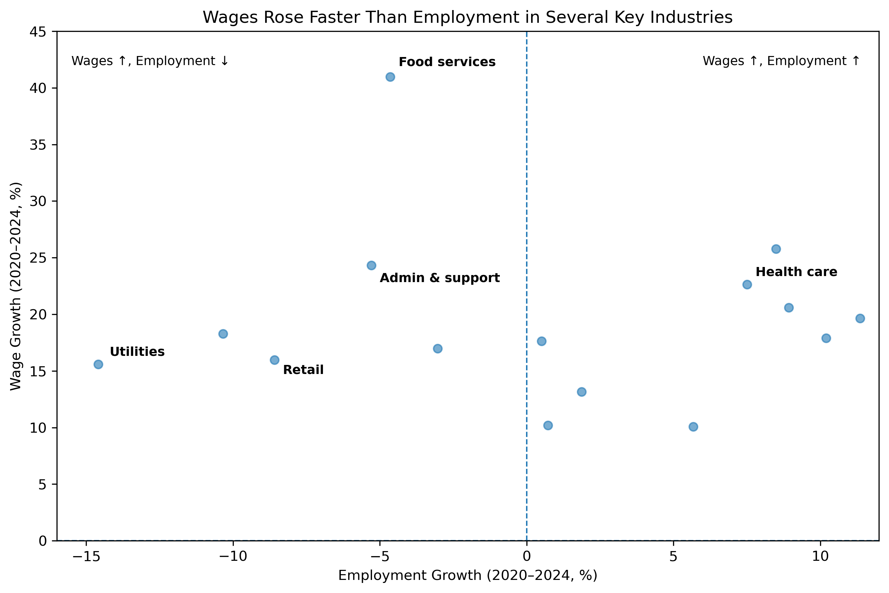

# Private Equity, Labor Cost Pressure, and Industry Dynamics (2020–2024)

Applied econometrics project using BLS data to identify industry-level labor cost pressures and their implications for private equity strategy.

---

## Executive Summary

This project analyzes industry-level labor market dynamics in the United States from 2020 to 2024 using BLS QCEW data. The focus is on identifying sectors where wage growth outpaced employment growth, creating labor cost pressure.

The results show that several service industries experienced rising per-worker labor costs, driven by strong wage growth alongside weak or declining employment. In some cases, total payroll increased despite workforce contraction, indicating that higher compensation per worker—not hiring—was the primary driver of labor cost growth.

This analysis examines how labor market dynamics evolved across major U.S. industries between 2020 and 2024, with a focus on identifying sectors experiencing elevated labor cost pressure. Rather than estimating causal effects of private equity (PE) ownership, the analysis identifies industry-level conditions under which PE strategies—such as consolidation, automation, or operational restructuring—may be more likely to emerge.

---

## Key Results

### Labor Cost Pressure by Industry

Industries where wage growth exceeded employment growth, indicating rising labor cost pressure.

---

### Employment Growth vs Industry Size

Smaller industries exhibit more extreme percentage changes, largely reflecting base effects rather than broad labor market shifts.

---

### Employment vs Wage Growth

Several industries experienced wage growth that outpaced employment growth, suggesting rising per-worker labor costs.

---

## Research Questions

1. How did employment and wages evolve across major U.S. industries between 2020 and 2024?  
2. In which industries did wage growth outpace employment growth, creating labor cost pressure?  
3. Do these labor dynamics suggest industry conditions commonly associated with private equity strategies?  

---

## Data

- Bureau of Labor Statistics (BLS), Quarterly Census of Employment and Wages (QCEW)  
- Annual averages by industry  
- Coverage: U.S. private-sector industries  
- Time period: 2020–2024  

Industries are analyzed at the NAICS sector level to ensure consistency and comparability.

---

## Methodology

### Core Measures

- Employment: Annual average employment by industry  
- Wages: Average weekly wages (BLS definition)  
- Payroll (approx.): average weekly wage × employment × 52  

### Growth Measures (2020–2024)

- Employment growth (%)  
- Wage growth (%)  
- Payroll growth (%)  

### Labor Cost Pressure

Defined as:

Wage growth − Employment growth (percentage points)

Positive values indicate rising per-worker labor costs.

Outliers driven by base effects (e.g., Construction) are handled separately to preserve interpretability.

---

## Key Findings

- Most industries experienced wage growth between 2020 and 2024  
- Employment recovery was uneven across sectors  
- In several industries, wages increased despite flat or declining employment  
- In some cases, total payroll increased even as employment fell  

---

## Focus Sector: Administrative and Support Services (NAICS 56)

Between 2020 and 2024:

- Employment: −5.3%  
- Wage growth: +24.3%  
- Payroll growth: +17.8%  
- Labor cost pressure: +29.6 pp  

Despite workforce contraction, firms increased total labor spending due to higher per-worker compensation.

---

## Interpretation and Private Equity Relevance

This project does not estimate causal effects of private equity ownership. Instead, it identifies industry-level conditions that may increase incentives for private equity strategies.

Industries with elevated labor cost pressure are often characterized by:

- Labor-intensive operations  
- Rising per-worker costs  
- Limited short-run substitution  
- Fragmented firm structures  

These conditions may create incentives for:

- Consolidation  
- Operational standardization  
- Automation  
- Cost restructuring  

---

## Limitations

- Industry-level analysis (not firm-level)  
- Wage measures may reflect compositional changes  
- Payroll is approximated  
- No direct private equity ownership data  
- Nominal values (not inflation-adjusted)  

---

## Future Work

- Link firms to private equity ownership (e.g., PitchBook, Preqin)  
- Compare PE vs non-PE firms  
- Conduct causal analysis (e.g., difference-in-differences)  
- Analyze more granular NAICS levels  
- Incorporate price and productivity data  

---

## Repository Structure

pe-industry-labor-analysis/  
├── data/  
│   ├── raw/  
│   └── processed/  
├── notebooks/  
│   └── 01_exploratory_analysis.ipynb  
├── figures/  
├── README.md  

---

## Summary

This project presents an applied analysis of U.S. labor market dynamics using publicly available data. By constructing and comparing employment, wage, and payroll measures, the analysis identifies industries experiencing elevated labor cost pressure.

The results highlight how divergence between wage and employment growth can signal changing cost structures and potential shifts in firm behavior. The project emphasizes clear interpretation, transparent methodology, and well-defined limitations, providing a strong foundation for future firm-level and causal analysis.