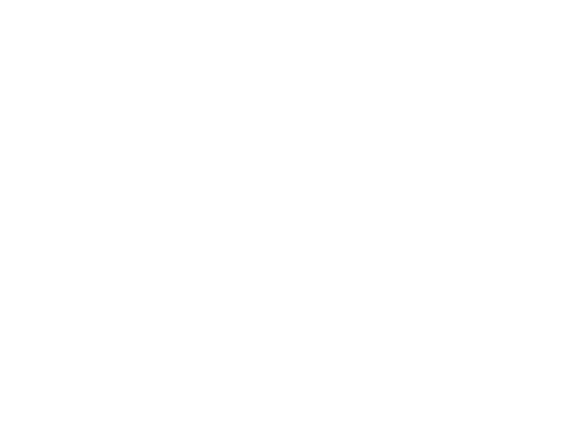
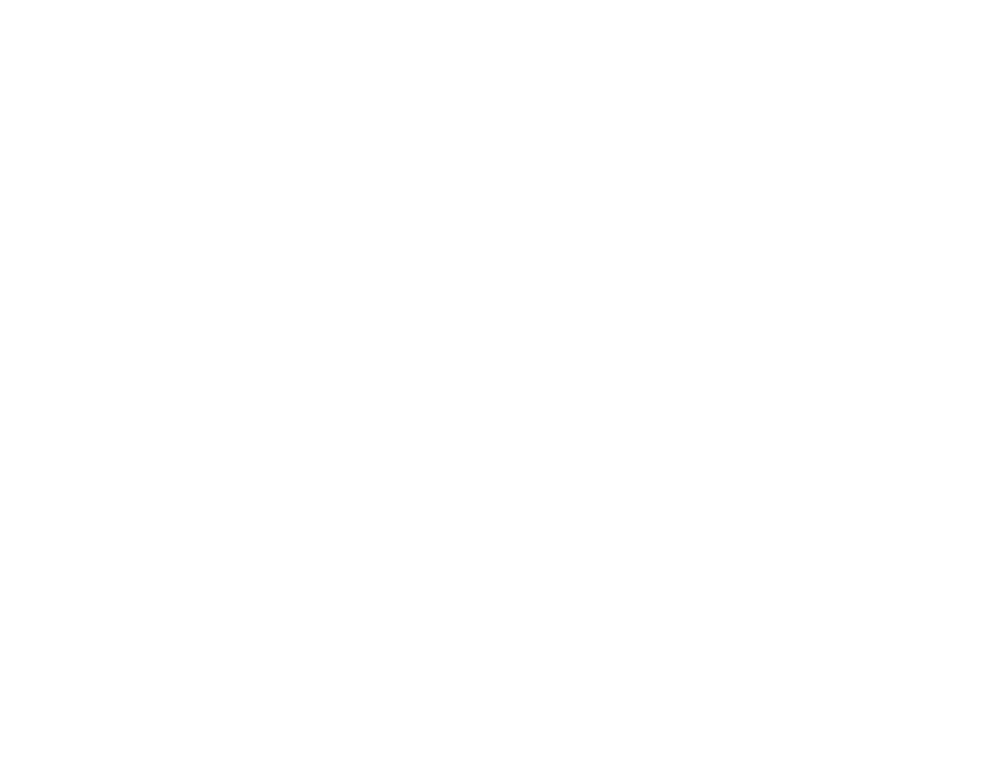

## Key Results

### Labor Cost Pressure by Industry

### Employment Growth vs Industry Size

Private Equity, Labor Cost Pressure, and Industry Dynamics (2020–2024)

Project Overview

## Executive Summary

This project examines industry-level labor market dynamics in the United
States from 2020 to 2024 to identify sectors experiencing elevated labor
cost pressure. Using data from the Bureau of Labor Statistics Quarterly
Census of Employment and Wages (QCEW), the analysis compares trends in
employment, wages, and total payroll across major NAICS service
industries.

The results show that several labor-intensive service sectors experienced
a combination of strong wage growth and weak or declining employment,
leading to rising labor cost pressure. In some industries, total payroll
increased despite workforce contraction, indicating that higher
per-worker compensation—rather than employment expansion—was the primary
driver of labor cost growth.

This project does not estimate the causal effects of private equity
ownership. Instead, it identifies industry-level conditions under which
private equity strategies such as consolidation, operational
standardization, or cost restructuring may be economically plausible.
The analysis serves as a motivation for subsequent firm-level research
examining how private equity ownership is associated with worker and
consumer-facing outcomes in sectors exhibiting these labor dynamics.

This project examines how labor market dynamics evolved across major U.S. industries between 2020 and 2024, with a focus on identifying sectors experiencing elevated labor cost pressure. Rather than attempting to measure the causal effects of private equity (PE) ownership, the analysis identifies industry-level conditions under which private equity strategies may be more likely to emerge, such as consolidation, automation, or operational restructuring.

The project is designed as an applied economic and policy-relevant analysis that leverages publicly available labor market data to motivate deeper, firm-level research on private equity and worker outcomes.

⸻

Research Questions
	1.	How did employment and wages evolve across major U.S. industries between 2020 and 2024?
	2.	In which industries did wage growth outpace employment growth, creating labor cost pressure?
	3.	Do these labor dynamics suggest industry conditions commonly associated with private equity strategies?

⸻

Data Sources
	•	Bureau of Labor Statistics (BLS), Quarterly Census of Employment and Wages (QCEW)
	•	Annual averages by industry
	•	Coverage: U.S. private-sector industries
	•	Time period: 2020–2024

Industries are analyzed at the NAICS sector level, ensuring consistent national coverage and comparability over time.

⸻

Methodology

Core Measures

The analysis relies on three complementary labor market measures:
	1.	Employment
	•	Annual average employment levels by industry
	2.	Average Weekly Wages
	•	Employment-weighted average weekly wages, calculated by BLS as total wages divided by average employment and weeks worked
	3.	Payroll (Approximate)
	•	Estimated as:
average weekly wage × average employment × 52
	•	Used to distinguish per-worker wage growth from changes in total labor spending

⸻

Growth Rates (2020–2024)

For each industry, the following growth rates are calculated:
	•	Employment growth (%)
	•	Wage growth (%)
	•	Payroll growth (%)

⸻

Labor Cost Pressure

Labor cost pressure is defined as:

Wage growth − Employment growth (percentage points)

Positive values indicate industries where labor costs increased faster than workforce expansion, suggesting potential margin pressure or labor market constraints.

⸻

Key Findings

Cross-Industry Patterns
	•	Most industries experienced nominal wage growth between 2020 and 2024.
	•	Employment recovery was uneven, with several sectors employing fewer workers in 2024 than in 2020.
	•	In some industries, total payroll increased despite declining employment, indicating rising labor costs driven by higher per-worker compensation.

⸻

Focus Sector: Administrative and Waste Services (NAICS 56)

Between 2020 and 2024, the administrative and waste services sector exhibited a distinctive combination of labor dynamics:
	•	Employment: −5.3%
	•	Average weekly wages: +24.3%
	•	Total payroll (approx.): +17.8%
	•	Labor cost pressure: +29.6 percentage points

Despite employing fewer workers, firms in this sector paid higher wages per worker and increased total labor spending overall. This pattern indicates rising labor cost pressure driven primarily by per-worker compensation rather than workforce expansion.

⸻

Interpretation and Private Equity Relevance

This project does not measure the causal impact of private equity ownership on workers or firms. Instead, it identifies industry-level conditions that may increase incentives for private equity strategies.

Administrative and waste services is characterized by:
	•	High labor intensity
	•	Fragmented firm structure
	•	Limited substitution possibilities in the short run
	•	Rising labor costs despite workforce contraction

These features align with environments in which private equity strategies—such as consolidation, operational standardization, automation, or outsourcing—may be particularly attractive. The findings motivate, but do not replace, firm-level analysis linking ownership structure to labor outcomes.

⸻

Limitations
	•	The analysis is conducted at the industry level, not the firm level.
	•	Average wages may reflect changes in worker composition, hours, or occupational mix.
	•	No direct data on private equity ownership is incorporated.
	•	Results reflect nominal wage and payroll changes and are not adjusted for inflation.

These limitations are explicitly acknowledged to avoid overinterpretation of results.

⸻

Extensions and Future Work

Potential extensions include:
	•	Linking firms to private equity ownership using deal-level data (e.g., PitchBook, Preqin)
	•	Comparing labor outcomes between PE-owned and non-PE firms within the same industry
	•	Conducting pre/post acquisition analyses
	•	Examining more granular NAICS industries (3–6 digit levels)
	•	Incorporating price or productivity data to assess pass-through mechanisms

⸻

Repository Structure

pe-industry-labor-analysis/
├── data/
│   ├── raw/
│   └── processed/
├── notebooks/
│   └── 01_exploratory_analysis.ipynb
├── README.md

⸻

## Summary

This project illustrates an applied, policy-relevant approach to using
publicly available labor market data to motivate research questions about
private equity activity without overstating causal claims. By focusing on
transparent construction of employment, wage, and payroll measures, the
analysis highlights how industry-level trends can be used to identify
plausible environments for operational restructuring and consolidation.

Equally important, the project emphasizes clear interpretation and
explicit limitations, distinguishing descriptive evidence from causal
inference. This framework provides a disciplined foundation for future
firm-level research linking ownership structure to worker and
consumer-facing outcomes.